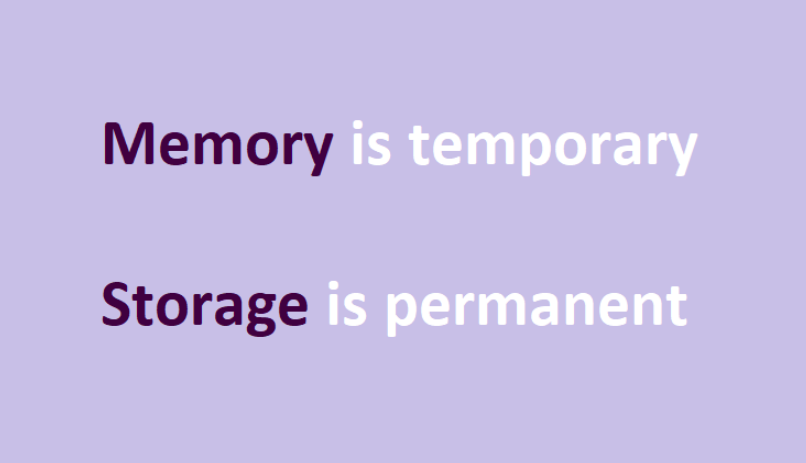

### --------Solidity--------------- 

#### Storage, Memory and the Stack 

The Ethereum Virtual Machine has three areas where it can store data- storage, memory and the stack, which are explained in the following paragraphs.

They are analogous to memory and hard drive storage in a computer. The contract can use any amount of memory (as long as it can pay for it of course) during executing its code, but when execution stops, the entire content of the memory is wiped, and the next execution will start fresh. The storage on the other hand is persisted into the blockchain itself, so the next time the contract executes some code, it has access to all the data it previously stored into its storage area.

> Each account has a data area called *<u>storage</u>*, which is persistent between function calls and transactions. Storage is a key-value store that maps 256-bit words to 256-bit words. It is not possible to enumerate storage from within a contract, it is comparatively costly to read, and even more to initialize and modify storage. Because of this cost, you should minimize what you store in persistent storage to what the contract needs to run. Store data like derived calculations, caching, and aggregates outside of the contract. A contract can neither read nor write to any storage apart from its own. 

> The second data area is called *<u>memory</u>*, of which a contract obtains a freshly cleared instance for each message call. Memory is linear and can be addressed at byte level, but reads are limited to a width of 256 bits, while writes can be either 8 bits or 256 bits wide. Memory is expanded by a word (256-bit), when accessing (either reading or writing) a previously untouched memory word (i.e. any offset within a word). At the time of expansion, the cost in gas must be paid. Memory is more costly the larger it grows (it scales quadratically). 

> The EVM is not a register machine but a *<u>stack</u>* machine, so all computations are performed on a data area called the stack. It has a maximum size of 1024 elements and contains words of 256 bits. Access to the stack is limited to the top end in the following way: It is possible to copy one of the topmost 16 elements to the top of the stack or swap the topmost element with one of the 16 elements below it. All other operations take the topmost two (or one, or more, depending on the operation) elements from the stack and push the result onto the stack. Of course it is possible to move stack elements to storage or memory in order to get deeper access to the stack, but it is not possible to just access arbitrary elements deeper in the stack without first removing the top of the stack.
